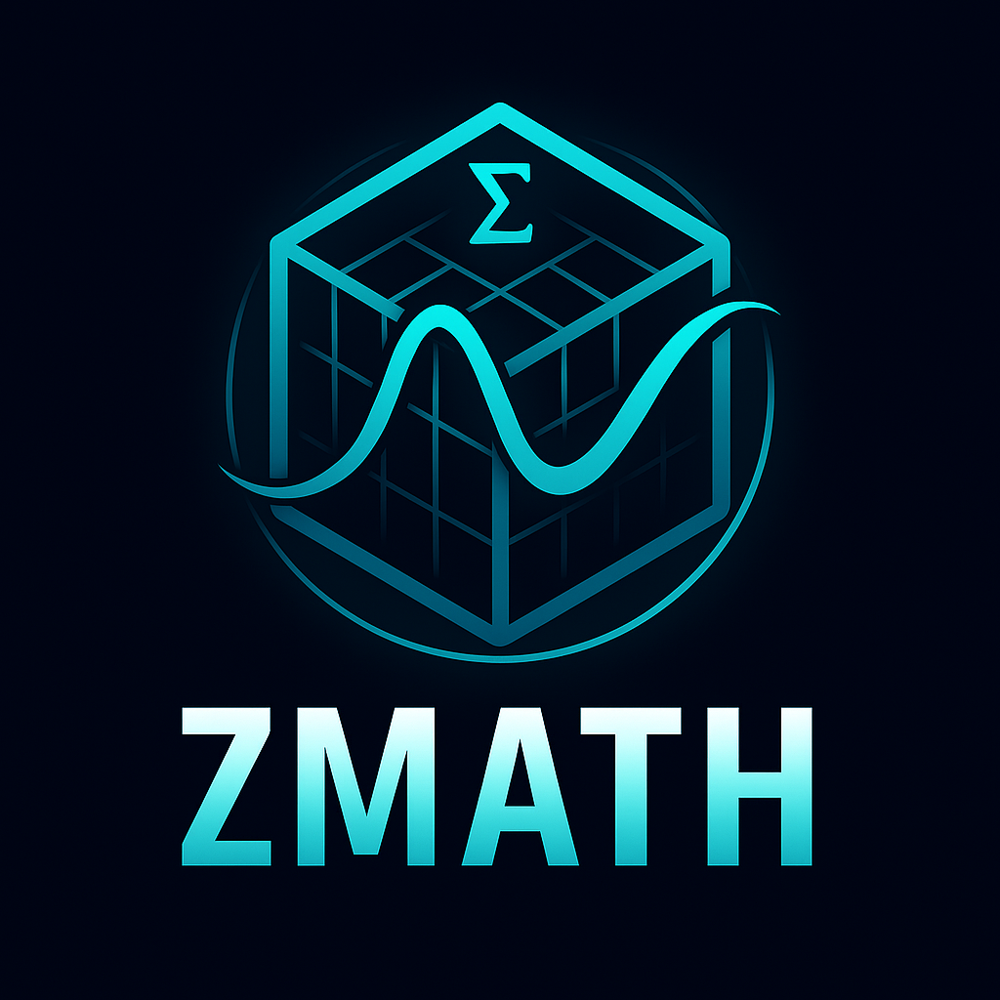

# zmath

<div align="center">
  

  [](https://ziglang.org/)
  [](https://ziglang.org/)
  [](https://en.wikipedia.org/wiki/Linear_algebra)
  [](https://en.wikipedia.org/wiki/Numerical_analysis)
</div>

**Advanced Mathematics Library for Zig**

zmath is a comprehensive mathematical computing library designed to replace C libraries like BLAS, LAPACK, and GSL. It provides high-performance linear algebra, statistical computing, and numerical analysis capabilities with a clean, idiomatic Zig interface.

## ✨ Features

### 🔢 Linear Algebra
- **Vector Operations**: Addition, subtraction, scalar multiplication, dot product, magnitude
- **Matrix Operations**: Addition, subtraction, multiplication, transpose, scalar multiplication
- **Advanced Matrix Factorization**: LU decomposition for solving linear systems, QR decomposition for least squares, eigenvalue/eigenvector computation
- **Memory Efficient**: Proper memory management with Zig allocators
- **Type Safe**: Compile-time dimension checking and error handling

### 📊 Statistical Computing
- **Descriptive Statistics**: Mean, variance, standard deviation
- **Data Analysis**: Min/max value detection
- **Robust**: Handles edge cases like empty datasets gracefully

### 🚀 Performance
- **Zero-cost Abstractions**: No runtime overhead from abstractions
- **Memory Safe**: Automatic memory management with RAII patterns
- **Optimized**: Designed for high-performance numerical computing
- **SIMD Acceleration**: Vectorized operations for improved performance
- **Optimization Algorithms**: Gradient descent for function minimization

## 🛠️ Installation

### Using Zig Package Manager

Add zmath to your `build.zig.zon`:

```zig
.{
    .name = "your-project",
    .version = "0.1.0",
    .dependencies = .{
        .zmath = .{
            .url = "https://github.com/ghostkellz/zmath/archive/main.tar.gz",
            .hash = "...", // zig will provide this
        },
    },
}
```

### Building from Source

```bash
git clone https://github.com/ghostkellz/zmath.git
cd zmath
zig build
```

## 📖 Quick Start

```zig
const std = @import("std");
const zmath = @import("zmath");

pub fn main() !void {
    var gpa = std.heap.GeneralPurposeAllocator(.{}){};
    defer _ = gpa.deinit();
    const allocator = gpa.allocator();

    // Vector operations
    const v1_data = [_]f64{ 1.0, 2.0, 3.0 };
    const v2_data = [_]f64{ 4.0, 5.0, 6.0 };

    var v1 = try zmath.Vector.initWithData(allocator, &v1_data);
    defer v1.deinit();
    var v2 = try zmath.Vector.initWithData(allocator, &v2_data);
    defer v2.deinit();

    // Vector addition
    var v_sum = try zmath.vec.add(allocator, v1, v2);
    defer v_sum.deinit();

    // Dot product
    const dot_product = try zmath.vec.dot(v1, v2);
    std.debug.print("Dot product: {d}\n", .{dot_product});

    // Matrix operations
    const m_data = [_]f64{ 1.0, 2.0, 3.0, 4.0 };
    var matrix = try zmath.Matrix.initWithData(allocator, 2, 2, &m_data);
    defer matrix.deinit();

    var transposed = try zmath.mat.transpose(allocator, matrix);
    defer transposed.deinit();

    // Statistical analysis
    const data = [_]f64{ 1.0, 2.0, 3.0, 4.0, 5.0 };
    const mean = zmath.stats.mean(&data);
    const std_dev = zmath.stats.standardDeviation(&data);

    std.debug.print("Mean: {d}, Std Dev: {d}\n", .{ mean, std_dev });
}
```

## 📚 API Reference

### Vector Operations

```zig
// Create vectors
var v = try Vector.init(allocator, size);
var v = try Vector.initWithData(allocator, &data);

// Operations
var result = try vec.add(allocator, v1, v2);
var result = try vec.subtract(allocator, v1, v2);
var result = try vec.scalarMultiply(allocator, v, scalar);
const dot = try vec.dot(v1, v2);
const mag = vec.magnitude(v);
```

### Matrix Operations

```zig
// Create matrices
var m = try Matrix.init(allocator, rows, cols);
var m = try Matrix.initWithData(allocator, rows, cols, &data);

// Operations
var result = try mat.add(allocator, m1, m2);
var result = try mat.subtract(allocator, m1, m2);
var result = try mat.multiply(allocator, m1, m2);
var result = try mat.transpose(allocator, m);
var result = try mat.scalarMultiply(allocator, m, scalar);

// Advanced operations
var lu = try mat.luDecompose(allocator, m);  // Returns {l: Matrix, u: Matrix}
defer lu.l.deinit();
defer lu.u.deinit();
var qr = try mat.qrDecompose(allocator, m);  // Returns {q: Matrix, r: Matrix}
defer qr.q.deinit();
defer qr.r.deinit();
```

### Statistical Functions

```zig
const mean = stats.mean(&data);
const variance = stats.variance(&data);
const std_dev = stats.standardDeviation(&data);
const min_val = stats.min(&data);
const max_val = stats.max(&data);
```

## 🧪 Testing

Run the complete test suite:

```bash
zig build test
```

Run the demonstration program:

```bash
zig build run
```

## 🎯 Roadmap

### Phase 1 ✅ (Current)
- [x] Basic vector operations
- [x] Basic matrix operations
- [x] Statistical functions
- [x] Comprehensive testing
- [x] Memory safety

### Phase 2 ✅ (Completed)
- [x] LU decomposition for solving linear systems
- [x] QR decomposition for least squares
- [x] Eigenvalue/eigenvector computation
- [x] FFT implementation
- [x] SIMD optimizations
- [x] Optimization algorithms (gradient descent)

### Phase 3 🔮 (Planned)
- [ ] GPU acceleration
- [ ] Sparse matrix support
- [ ] Advanced statistical distributions
- [ ] Machine learning primitives

## 🤝 Contributing

Contributions are welcome! Please read our [Contributing Guide](CONTRIBUTING.md) for details on our code of conduct and the process for submitting pull requests.

### Development Setup

```bash
git clone https://github.com/ghostkellz/zmath.git
cd zmath
zig build test  # Run tests
zig build run   # Run demonstration
```

## 📄 License

This project is licensed under the MIT License - see the [LICENSE](LICENSE) file for details.

## 🙏 Acknowledgments

- Inspired by BLAS, LAPACK, and GSL libraries
- Built with the amazing [Zig programming language](https://ziglang.org/)
- Thanks to the Zig community for their support and feedback

## 📞 Support

- 📖 [Documentation](https://github.com/ghostkellz/zmath/wiki)
- 🐛 [Issue Tracker](https://github.com/ghostkellz/zmath/issues)
- 💬 [Discussions](https://github.com/ghostkellz/zmath/discussions)

---

<div align="center">
  <sub>Built with Zig ⚡</sub>
</div>
